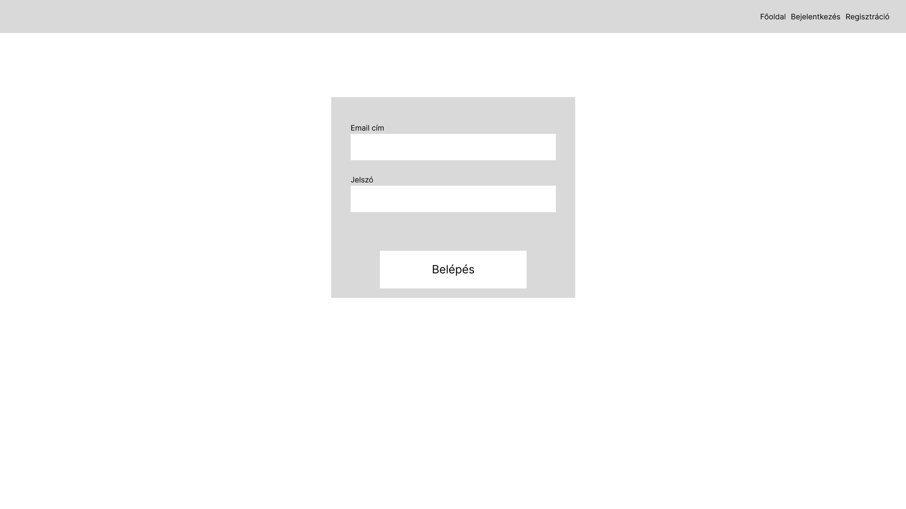
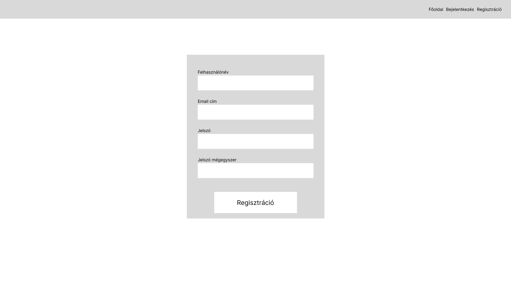
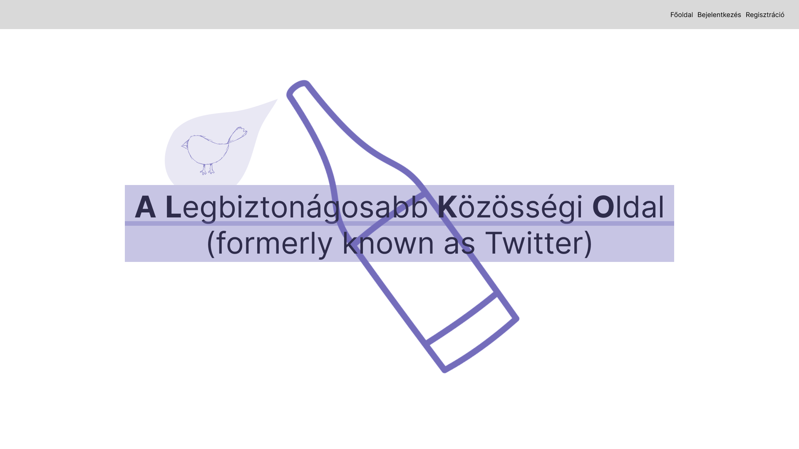
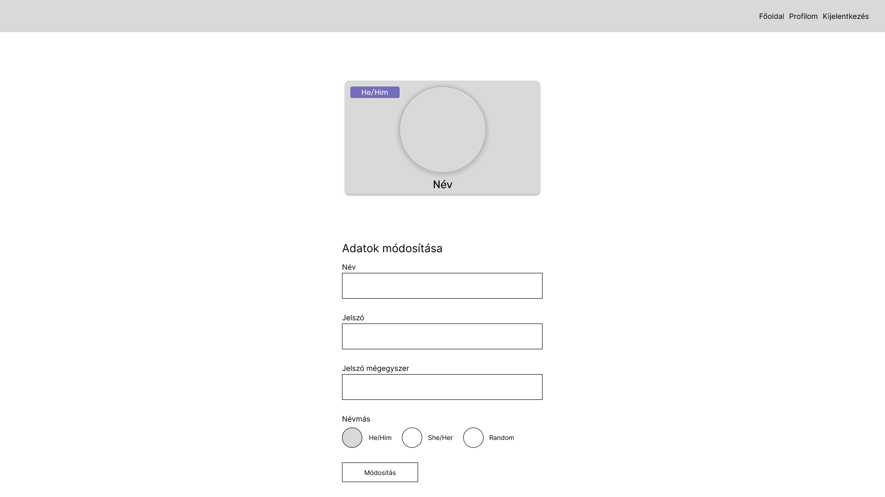
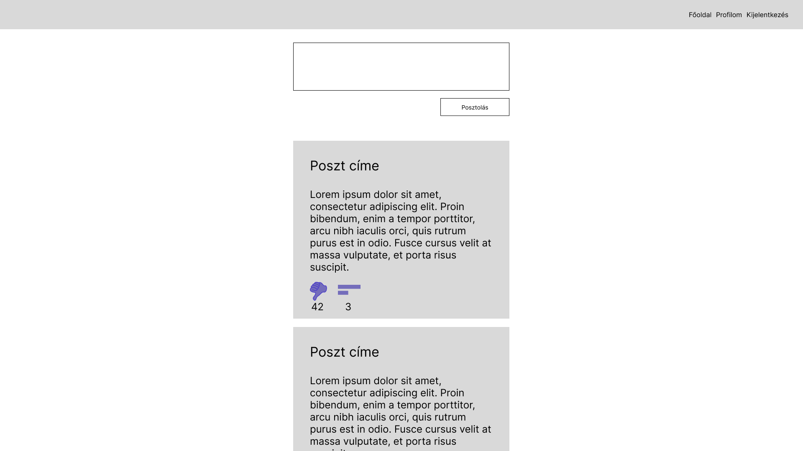

# 
A Legbiztonágosabb Közösségi Oldal   <small>Adatbázis alapú rendszerek beadandó</small>  

## Csapat bemutatkozó

- **Csapat neve**: `A Legbiztonságosabb Közösségi Oldal`
- **Csapat tagjai**:
  - **Horváth Gergely Zsolt** (`BYVAM0`)
  - **Stefán Kornél** (`TFRXIL`)
  - **Vass Kinga** (`IZT6ZK`)
- **Gyakorlat**: `Kedd 08:00-10:00`
- **Kurzuskód**: `szte-IB152l`
- **Szemeszter**: `23/24/2`
- **Értékelési mód**: `csapat`

## Bemutató

A Legbiztonságosabb Közösségi Oldal (röviden ALKO, formerly known as Twitter) egy olyan közösségi oldal, ahol a felhasználók adatait csak mi... kezeljük.

## Funkciók

- Regisztráció és bejelentkezés
- Etetés: Az alkalmazásunk mások tartalmát megeteti veled egy összesítő felületen.
- Megosztás: Rövid szöveges üzenetek megosztása maximum 15 szó.
  - A mai fiatalok kb. ennyit tudnak felfogni.
  - Tudományos kutatások kimutatták, hogy a mai ifjúság nem tud ennyinél több szót felfogni (n=0.541 szórással, df=39).
- Kedvelés: A felhasználók jelezhetik másnak a bejegyzésén, hogy nem felel meg a biztonsági alaptételnek.
- Megjegyzés: A felhasználók megjegyzéseket fűzhetnek mások bejegyzéseihez.
  - Megjegyzések karakterszáma oszthatónak kell lennie 3-al.
  - Megjegyzések számának korlátozása 3-ra (per felhasználó). Ez teszi biztonságossá a rendszert, mivel így nem törhetnek ki nagy viták.
- Követés: A felhasználók követhetik egymást.
- Profil: A felhasználók megtekinthetik a saját és mások profilját.
  - Részletes fiók megtekintés: A felhasználók részletesen megtekinthetik a fiókjukat.
  - Részletes pronoun megtekintés
  - Név megtekintése
  - Profilkép integráció (Gravatar)
- Részletes fiók szerkesztés: A felhasználók részletesen szerkeszthetik a fiókjukat.
  - Részletes pronoun beállítás
  - Név megváltoztatása
  - Profilkép integráció (Gravatar)
- ALKO Hol: Tartózkodási hely megosztása ismerősökkel.
- ALKO Tás: Művészi (Haiku) formában oszthatnak meg az emberek itt műveket.
  - A Haiku egy japán költői forma, melynek 5-7-5 szótagú sorai vannak.
  - A Haiku formátumú bejegyzéseknek a szótagszámot ellenőrizzük.
- Biznisz megoldások magas profilú ügyfeleink számára (pl: állambiztonság).

## Képernyő tervek

# Bejelentkezés

# Regisztráció

# Főoldal

# Profil

# Idővonal

## EK diagram

## EK Diagram értelmezés

> Fentről lefele megközelítés

User (<u>EmailAddress</u>, FirstName, MiddleName, LastName, PasswordHash, Pronouns, Watcher)

- {EmailAddress} -> FirstName, MiddleName, LastName, PasswordHash, Pronouns, Watcher

Following (<u>*UserEmailAddress*</u>, <u>*FollowingUserEmailAddress*</u>)

- 3 NF-ben van, mert mindkét attribútum kulcs.

EmailQueue (<u>EmailId</u>, Title, Content, SentAt, CreatedAt, Priority, *RecipientUserEmailAddress*)

- {EmailId} -> Title, Content, SentAt, CreatedAt, Priority, *RecipientUserEmailAddress*

WatchList (<u>WatchListId</u>, From, Until, *StalkedEmailAddress*, *StalkerEmailAddress*)

- {WatchListId} -> From, Until, *StalkedEmailAddress*, *StalkerEmailAddress*

Poetry (<u>PoetryId</u>, Content, CreationDate, *CreatorUserEmailAddress*)

- {PoetryId} -> Content, CreationDate, *CreatorUserEmailAddress*

Post (<u>PostId</u>, Content, CreationDate, Location, *CreatorUserEmailAddress*)

- {PostId} -> Content, CreationDate, Location, *CreatorUserEmailAddress*

Comment (<u>CommentId</u>, Content, CreationDate, *CreatorUserEmailAddress*, *CommentedOnPostId*, *CommentedOnPoetryId*)

- {CommentId} -> Content, CreationDate, *CreatorUserEmailAddress*, *CommentedOnPostId*, *CommentedOnPoetryId*

Engagement (<u>EngagementId</u>, CreationDate, *CreatorUserEmailAddress*, *EngagedWithPostId*, *EngagedWithPoetryId*)

- {EngagementId} -> CreationDate, *CreatorUserEmailAddress*, *EngagedWithPostId*, *EngagedWithPoetryId*

Minden attribútum atomi -> 1NF-ben vannak a relációsémák.

A sémákban egy kulcs van, kivéve a Following sémában, ahol viszont mindkét attribútum kulcs -> 2NF-ben vannak a relációsémák.

A fentebb felírt funkcionális függőségek alapján nincs tranzitív függés a sémákban -> 3NF-ben vannak a relációsémák.

## Funkcionális függőség elemzés

> Lentről felfele megközelítés

AllDataInDatabase(EmailAddress, UserFirstName, UserMiddleName, UserLastName, UserPasswordHash, UserPronouns, UserWatcher, UserFollowedUserEmailAddress, EmailId, EmailTitle, EmailContent, EmailSentAt, EmailCreatedAt, EmailPriority, EmailRecipientUserEmailAddress, WatchListId, WatchListFrom, WatchListUntil, WatchListStalkedEmailAddress, WatchListStalkerEmailAddress, PoetryId, PoetryContent, PoetryCreationDate, PoetryCreatorUserEmailAddress, PostId, PostContent, PostCreationDate, PostLocation, CommentId, CommentContent, CommentCreationDate, CommentCreatorUserEmailAddress, CommentedOnPostId, CommentedOnPoetryId, EngagementId, EngagementCreatorUserEmailAddress, EngagementCreationDate, EngagedWithPostId, EngagedWithPoetryId)

- {EmailAddress} -> UserFirstName, UserMiddleName, UserLastName, UserPasswordHash, UserPronouns, UserWatcher
- {EmailId} -> EmailTitle, EmailContent, EmailSentAt, EmailCreatedAt, EmailPriority, EmailRecipientUserEmailAddress
- {WatchListId} -> WatchListFrom, WatchListUntil, WatchListStalkedEmailAddress, WatchListStalkerEmailAddress
- {PoetryId} -> PoetryContent, PoetryCreationDate, PoetryCreatorUserEmailAddress
- {PostId} -> PostContent, PostCreationDate, PostLocation
- {CommentId} -> CommentContent, CommentCreationDate, CommentCreatorUserEmailAddress, CommentedOnPostId, CommentedOnPoetryId
- {EngagementId} -> EngagementCreatorUserEmailAddress, EngagementCreationDate, EngagedWithPostId, EngagedWithPoetryId

1. Válasszuk a felhasználó táblát külön az `EmailAddress` mentén

> Vegyük észre, hogy a UserFollowedUserEmailAddress, EmailRecipientUserEmailAddress, WatchListStalkedEmailAddress, WatchListStalkerEmailAddress, PoetryCreatorUserEmailAddress, CommentCreatorUserEmailAddress, EngagementCreatorUserEmailAddress mind UserEmailAddress-re mutatnak.

User(<u>EmailAddress</u>, FirstName, MiddleName, LastName, PasswordHash, Pronouns, UserWatcher)

AllDataInDatabase2(EmailId, EmailTitle, EmailContent, EmailSentAt, EmailCreatedAt, EmailPriority, *EmailRecipientUserEmailAddress*, WatchListId, WatchListFrom, WatchListUntil, *WatchListStalkedEmailAddress*, *WatchListStalkerEmailAddress*, PoetryId, PoetryContent, PoetryCreationDate, *PoetryCreatorUserEmailAddress*, PostId, PostContent, PostCreationDate, PostLocation, CommentId, CommentContent, CommentCreationDate, *CommentCreatorUserEmailAddress*, CommentedOnPostId, CommentedOnPoetryId, EngagementId, *EngagementCreatorUserEmailAddress*, EngagementCreationDate, EngagedWithPostId, EngagedWithPoetryId)

2. Válasszuk az EmailQueue táblát külön az `EmailId` mentén

User(<u>EmailAddress</u>, FirstName, MiddleName, LastName, PasswordHash, Pronouns, UserWatcher)
EmailQueue(<u>EmailId</u>, Title, Content, SentAt, CreatedAt, Priority, *RecipientUserEmailAddress*)

AllDataInDatabase3(WatchListId, WatchListFrom, WatchListUntil, *WatchListStalkedEmailAddress*, *WatchListStalkerEmailAddress*, PoetryId, PoetryContent, PoetryCreationDate, *PoetryCreatorUserEmailAddress*, PostId, PostContent, PostCreationDate, PostLocation, CommentId, CommentContent, CommentCreationDate, *CommentCreatorUserEmailAddress*, CommentedOnPostId, CommentedOnPoetryId, EngagementId, *EngagementCreatorUserEmailAddress*, EngagementCreationDate, EngagedWithPostId, EngagedWithPoetryId)

3. Válasszuk a WatchList táblát külön a `WatchListId` mentén

User(<u>EmailAddress</u>, FirstName, MiddleName, LastName, PasswordHash, Pronouns, UserWatcher)
EmailQueue(<u>EmailId</u>, Title, Content, SentAt, CreatedAt, Priority, *RecipientUserEmailAddress*)
WatchList(<u>WatchListId</u>, From, Until, *StalkedEmailAddress*, *StalkerEmailAddress*)

AllDataInDatabase4(PoetryId, PoetryContent, PoetryCreationDate, *PoetryCreatorUserEmailAddress*, PostId, PostContent, PostCreationDate, PostLocation, CommentId, CommentContent, CommentCreationDate, *CommentCreatorUserEmailAddress*, CommentedOnPostId, CommentedOnPoetryId, EngagementId, *EngagementCreatorUserEmailAddress*, EngagementCreationDate, EngagedWithPostId, EngagedWithPoetryId)

4. Válasszuk a Poetry táblát külön a `PoetryId` mentén

User(<u>EmailAddress</u>, FirstName, MiddleName, LastName, PasswordHash, Pronouns, UserWatcher)
EmailQueue(<u>EmailId</u>, Title, Content, SentAt, CreatedAt, Priority, *RecipientUserEmailAddress*)
WatchList(<u>WatchListId</u>, From, Until, *StalkedEmailAddress*, *StalkerEmailAddress*)
Poetry(<u>PoetryId</u>, Content, CreationDate, *CreatorUserEmailAddress*)

AllDataInDatabase5(PostId, PostContent, PostCreationDate, PostLocation, CommentId, CommentContent, CommentCreationDate, *CommentCreatorUserEmailAddress*, CommentedOnPostId, CommentedOnPoetryId, EngagementId, *EngagementCreatorUserEmailAddress*, EngagementCreationDate, EngagedWithPostId, EngagedWithPoetryId)

5. Válasszuk a Post táblát külön a `PostId` mentén

User(<u>EmailAddress</u>, FirstName, MiddleName, LastName, PasswordHash, Pronouns, UserWatcher)
EmailQueue(<u>EmailId</u>, Title, Content, SentAt, CreatedAt, Priority, *RecipientUserEmailAddress*)
WatchList(<u>WatchListId</u>, From, Until, *StalkedEmailAddress*, *StalkerEmailAddress*)
Poetry(<u>PoetryId</u>, Content, CreationDate, *CreatorUserEmailAddress*)
Post(<u>PostId</u>, Content, CreationDate, Location, *CreatorUserEmailAddress*)

AllDataInDatabase6(CommentId, CommentContent, CommentCreationDate, *CommentCreatorUserEmailAddress*, CommentedOnPostId, CommentedOnPoetryId, EngagementId, *EngagementCreatorUserEmailAddress*, EngagementCreationDate, EngagedWithPostId, EngagedWithPoetryId)

6. Válasszuk a Comment táblát külön a `CommentId` mentén

User(<u>EmailAddress</u>, FirstName, MiddleName, LastName, PasswordHash, Pronouns, UserWatcher)
EmailQueue(<u>EmailId</u>, Title, Content, SentAt, CreatedAt, Priority, *RecipientUserEmailAddress*)
WatchList(<u>WatchListId</u>, From, Until, *StalkedEmailAddress*, *StalkerEmailAddress*)
Poetry(<u>PoetryId</u>, Content, CreationDate, *CreatorUserEmailAddress*)
Post(<u>PostId</u>, Content, CreationDate, Location, *CreatorUserEmailAddress*)
Comment(<u>CommentId</u>, Content, CreationDate, *CreatorUserEmailAddress*, *CommentedOnPostId*, *CommentedOnPoetryId*)

AllDataInDatabase7(EngagementId, *EngagementCreatorUserEmailAddress*, EngagementCreationDate, EngagedWithPostId, EngagedWithPoetryId)

7. Lássuk be, hogy a maradt tulajdonságok az Engagement tábla

User(<u>EmailAddress</u>, FirstName, MiddleName, LastName, PasswordHash, Pronouns, UserWatcher)
EmailQueue(<u>EmailId</u>, Title, Content, SentAt, CreatedAt, Priority, *RecipientUserEmailAddress*)
WatchList(<u>WatchListId</u>, From, Until, *StalkedEmailAddress*, *StalkerEmailAddress*)
Poetry(<u>PoetryId</u>, Content, CreationDate, *CreatorUserEmailAddress*)
Post(<u>PostId</u>, Content, CreationDate, Location, *CreatorUserEmailAddress*)
Comment(<u>CommentId</u>, Content, CreationDate, *CreatorUserEmailAddress*, *CommentedOnPostId*, *CommentedOnPoetryId*)
Engagement(<u>EngagementId</u>, *CreatorUserEmailAddress*, CreationDate, EngagedWithPostId, EngagedWithPoetryId)

## EK Diagram elemzések egyesítése, értékelés

Az EK elemzések során megállapítottuk, hogy az azonosítók mentén azonos táblastruktúrára jutunk a két módszerrel. Ez nem feltétlen jelenti az optimális megoldást, de biztosak lehetünk abban, hogy az adatbázisunk 3NF-ben van.

## Egyed Modell

## Fizikai adatfolyam

## Logikai adatfolyam

## Szerep-funkció mátrix

## Egyed-esemény mátrix

## Funkció meghatározás

## Menütervek

### Felhasználó

### ÁVH Felhasználó

## Munkafelosztás

### 1. mérföldkő

### 2. mérföldkő

### 3-4. mérföldkő

